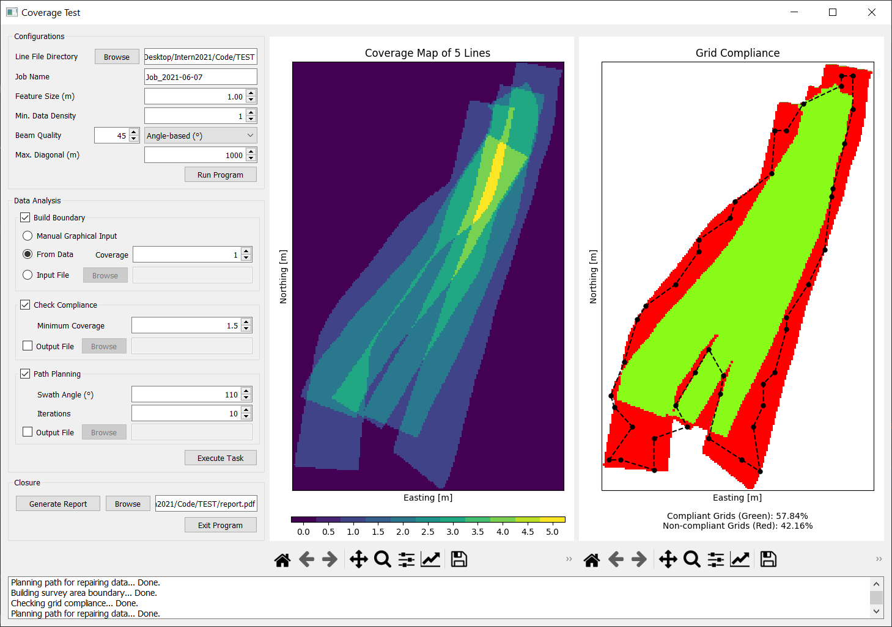

# Coverage Analyser and Path Planner
A Python-based software for testing coverage of bathymetric data based on [International Hydrographic Organization Standards for Hydrographic Surveys (S44) Edition 6.0](https://iho.int/uploads/user/pubs/Drafts/S-44_Edition_6.0.0-Final.pdf).

## Contents
* [Getting Started](#getting-started)
  * [Setting Up Python Environment](#setting-up-python-environment)
* [Usage](#usage)
  * [Test Configurations](#test-configurations)
  * [Data Analysis](#data-analysis)
  * [Test Results](#test-results)
  * [Test Reporting](#test-reporting)
* [Credits](#credits)
* [Authors](#authors)
* [License](#license)


## Getting Started
To use this software on Windows without setting up Python, download the ```build/exe.win-amd64-3.9/``` directory and launch the ```CoverTest.exe``` executable file. The executable was packed by using [cx_freeze](https://cx-freeze.readthedocs.io/en/latest/).

### Setting Up Python Environment
Use **Python 3.9** and install all the dependencies with:
```
pip install -r requirements.txt
```
Next, run the script file as below:
```
python main.py
```

## Usage
The software accepts semi-processed bathymetric data (*ASCII* files with the ```.txt``` extension generated by hydrographic software, e.g., [CARIS Process Model](https://www.teledynecaris.com/en/products/whats-new/hips-and-sips/)). Each input file should contain data collected from a **single** trackline. The input file must be in the following format:

* First row: Header row
* First column: Easting in *metres*
* Second column: Northing in *metres*
* Third column: Depth in *metres*
* Fourth column (optional): Acr Angle in *degrees* OR Beam Detection Type

At startup, the software will bring up a frontend UI that allows users to specify survey standards, select analysis and view analysis results.

<p align="center">

</p>

### Test Configurations
The ```Configurations``` section allows users to select an input file directory and specify the required survey standards. 

* ```Line File Directory``` should be pointed to where the input files are stored. The software uses the [watchdog](https://pythonhosted.org/watchdog/) module to monitor file system events in the selected directory. The software will automatically check for existing and newly added ```.txt``` files in the selected directory.

* ```Job Name``` parameter allows users to set the name recorded in the test report. It does not affect the test results. By default, it is named after the current date.

* ```Feature Size``` is the required size of feature detection in *metres*. It will be used as the grid size for constructing the bathymetric coverage map. The default value is 1.0 metre.

* ```Min. Data Density``` is the minimum number of datapoints required by every grid. Grids with datapoints less than this parameter will be rejected in the bathymetric coverage. The default value is 1.

* ```Beam Quality``` is an optional data quality classifier for classifying data based on the beam quality. Good data has a contribution of 100% coverage, while bad data contributes to 50% coverage. The drop-down list has 3 options:
  * ```N/A``` disables the quality classifier.
  * ```Status-based``` classifies the data based on types of beam detection used (amplitude/phase).
  * ```Angle-based``` classifies the data based on beam angle (users can select the maximum beam angle of good data. Default is 45°).

* ```Max. Diagonal``` is the maximum (approximated) diagonal size of the survey area. It will be used for constructing the grids of the bathymetric coverage map. The given diagonal size must be larger than the actual size to construct the coverage map correctly (but excessive diagonal size will decrease the software performance). The default value is 1000 metres.

Clicking on the ```Run Program``` button will start running the software and prevent further changes to the selected directory and configurations. A restart will be required to make any changes. When the software is running, existing and newly added files in the selected directory will be read to compute a bathymatric coverage map. The software uses [Binary Search](https://github.com/astrofrog/fast-histogram) to bin the data into the grids of the coverage map. After reading the first input file, the left plot window will display the coverage map.

### Data Analysis
The ```Data Analysis``` section allows users to analyse and check input data against the required survey standards. Users have the option to select one or more of the following tasks (by checking the boxes).

* ```Build Boundary``` - Users can build the boundary of survey areas for analysis. After executing this task, the right plot window will display the resultant boundary. A boundary must consist of at least 3 points and can be built by using one of the following methods:
  * ```Manual Graphical Input``` - Build boundary manually by clicking in sequence on the coverage map (left plot window). Left-click to select; right-click to deselect; mid-click to confirm selection.
  * ```Use Current Data``` - Build boundary automatically based on the current input data. [Delaunay Triangulation](https://gist.github.com/AndreLester/589ea1eddd3a28d00f3d7e47bd9f28fb) is used to build a concave hull that will enclose data of a desired bathymetric coverage. Users can specify the desired ```Coverage``` (default value is 1).
  * ```Input File``` - Build boundary from an *ASCII* file. The input file must have a header row, an Easting (first) column in *metres*, and a Northing (second) column in *metres*.

* ```Check Compliance``` - Users can check the compliance of data against the survey standards by specifying a desired ```Minimum Coverage``` (default value is 1). This task can only be executed after building a feasible boundary. The software uses a fast [ray casting algorithm](https://ieeexplore.ieee.org/document/9286157) that performs a boundary crossing number test to identify the non-compliant grids. After executing this task, the right plot window will display the grid compliance map. Users have the option to output the grid compliance map in the selected format: ```.tif (geotif)``` (geo-referenced TIF raster image produced by [rasterio](https://rasterio.readthedocs.io/en/latest/); users need to define the coordinate reference system by [EPSG code](https://spatialreference.org/ref/epsg/)), ```.wpt``` (list of coordinates in a waypoint format accepted by [CARIS onboard](https://www.teledynecaris.com/en/products/whats-new/caris-onboard/)), or ```.txt / .csv``` (list of coordinates in *ASCII* text file).

* ```Path Planning``` - Users can generate a mission plan to repair non-compliant data. This task can only be executed if there is any non-compliant grids. The software can group non-compliant grids into a minimum number of waypoints by using [*k*-d tree structure](https://docs.scipy.org/doc/scipy/reference/generated/scipy.spatial.KDTree.html) and a **Greedy Set Cover Algorithm**. The number of resultant waypoints is dependent on the swath width, which can be controlled by a user-specified ```Swath Angle``` (default value is 110°). Next, the software uses the [Lin-Kernighan Heuristic (LKH)](http://akira.ruc.dk/~keld/research/LKH/) algorithm to determine the shortest path for repairing the non-compliant data. Users have the option to output the resultant path and its waypoints in the selected format: ```.wpt``` (list of coordinates in a waypoint format accepted by [CARIS onboard](https://www.teledynecaris.com/en/products/whats-new/caris-onboard/)), or ```.txt / .csv``` (list of coordinates in *ASCII* text file).


### Test Results
The software uses [Matplotlib](https://matplotlib.org/) to generate test results on two plot windows. The left plot window displays a bathymetric coverage map with Easting in *metres* on the x-axis and Northing in *metres* on the y-axis. The coverage map shows the number of times a grid has been covered by a compliant reading from independent tracklines.

The right plot window displays a grid compliance map with Easting in *metres* on the x-axis and Northing in *metres* on the y-axis. Compliant grids are shown in green colour, while non-compliant grids are in red colour. The percentage of grid compliance within the given boundary is shown at the bottom of the plot window.

Users can manipulate the views of dataset in the plot windows by using the navigation toolbars that are embedded below the windows. The description of each of the buttons on the toolbars is as follows:


* The first button from the left is the ```Home``` button, which is used to bring back the first (default) view of the data. The next two buttons are the ```Forward``` and ```Back``` buttons respectively, which are used to navigate back and forth between previously defined views.

* The fourth is the ```Pan/Zoom``` button. This button has two modes: pan and zoom. Click this button to activate panning and zooming mode, then put the mouse somewhere over an axes. Press the left mouse button and hold it to pan the figure and drag it to a new position. Press and hold the right mouse button to zoom. The x axis will be zoomed in proportionately to the rightward movement and zoomed out proportionately to the leftward movement. The same is true for the y axis and up/down motions.

* The fifth is the ```Zoom-to-rectangle``` button. Click this button to activate zooming mode. Put the mouse somewhere over an axes and press a mouse button. Define a rectangular region by dragging the mouse while holding the button to a new location. When using the left mouse button, the axes view limits will be zoomed to the defined region. When using the right mouse button, the axes view limits will be zoomed out, placing the original axes in the defined region.

* The second to last is the ```Subplot-configuration``` button. Use this tool to configure the appearance of the plot by adjusting the left, right, top, or bottom space of the plot, or the space between the subplot rows or columns. The next to last is the ```Figure-option``` button. Use this tool to adjust the colors, line styles, markers in the plot.

* The last button is the ```Save``` button. Click this button to launch a file save dialog. Figures can be saved with the following extensions: ```.png```, ```.jpg```, ```.tif```, ```.ps```, ```.eps```, ```.svg```, ```.pgf``` and ```.pdf```.

### Test Reporting
Users can generate a test report after checking grid compliances. The report will contain the following information:
* Job name
* Date and time when the report is generated
* Feature size requirement
* Bathymetric coverage requirement
* Minimum data density
* Selected data quality classifier
* Total number of lines processed
* Coverage map
* Grid compliance map

## Credits
The software uses the following open source packages, as well as several packages that are mentioned and linked above.
* [Numpy](https://numpy.org/doc/stable/reference/index.html) and [Pandas](https://pandas.pydata.org/docs/index.html) - Data structure used.
* [PyQt5](https://doc.qt.io/qtforpython/) - UI framework used.
* [QThreadPool](https://doc.qt.io/qt-5/qthreadpool.html) - Multi-threading framework used.

## Authors
* Hui Sheng Lim ([xanxustyle](https://github.com/xanxustyle)) - Developer.
* Nathan Green - Project advisor/supervisor.

## License
This project is released under the GNU General Public License v3.0 license - see the [LICENSE.md](LICENSE.md) file for details
