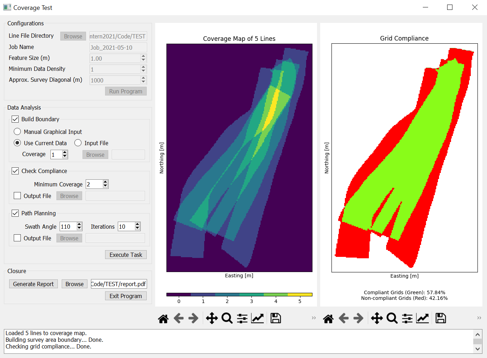

# CoverTest Program
Coverage test of bathymetric data based on IHO S44 Edition 6.0

## Getting Started
To use this program on Windows without setting up Python, download the ```build/exe.win-amd64-3.9/``` directory and launch the ```CoverTest.exe``` executable file. The executable was packed by using [cx_freeze](https://pypi.org/project/cx-Freeze/).

### Setting Up Python Environment
Use **Python 3.9** and install all the dependencies with:
```
pip install -r requirements.txt
```
Next, run the script file as below:
```
python main.py
```

## Usage
The program accepts semi-processed bathymetric data (*ASCII* files with the ```txt``` extension). Each input file should contain data collected from a **single** trackline. The input file must be in the following format:

* First row: Header row
* First column: Easting in metres
* Second column: Northing in metres
* Third column: Depth in metres

At startup, the CoverTest program will bring up a frontend UI that allows users to specify survey standards and view test results.

<p align="center">

</p>

### Test Configurations
The configuration section allows users to select a line file directory and specify the required survey standards. 

The ```Line File Directory``` is where the input files are stored. The program uses the [watchdog](https://pythonhosted.org/watchdog/) module to monitor file system events in the selected directory.

### Data Analysis


#### Test Results


### Test Reporting


## Built With
* [PyQt5](https://doc.qt.io/qtforpython/) - UI framework used.
* [QThreadPool](https://doc.qt.io/qt-5/qthreadpool.html) - Multi-threading framework used.

## Authors
* Hui Sheng Lim ([xanxustyle](https://github.com/xanxustyle)) - Developer.
* Nathan Green - Project advisor/supervisor.

## License
This project is released under the GNU General Public License v3.0 license - see the [LICENSE.md](LICENSE.md) file for details
